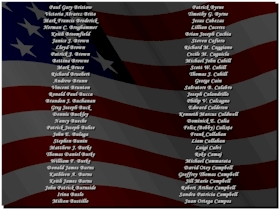



## Remembrance

### Description

Small program made to remember all those who lost their lives on Sept. 11, 2001. For all those who have never taken the time to look at the complete list of names of those who died on that day, this program will show you the magnitude of people killed on that day. I got the list of names from http://www.washingtonpost.com/wp-adv/marketing/911/front.html and apologize in advance if anybody out there finds that a name is missing. God Bless America.
 
### More Info
 

             |
---                |---
**Submitted On**   |2002-09-10 14:21:02
**By**             |[Clint LaFever](https://github.com/Planet-Source-Code/PSCIndex/blob/master/ByAuthor/clint-lafever.md)
**Level**          |Beginner
**User Rating**    |4.6 (65 globes from 14 users)
**Compatibility**  |VB 5\.0, VB 6\.0
**Category**       |[Complete Applications](https://github.com/Planet-Source-Code/PSCIndex/blob/master/ByCategory/complete-applications__1-27.md)
**World**          |[Visual Basic](https://github.com/Planet-Source-Code/PSCIndex/blob/master/ByWorld/visual-basic.md)
**Archive File**   |[Remembranc1292979102002\.zip](https://github.com/Planet-Source-Code/clint-lafever-remembrance__1-38840/archive/master.zip)

